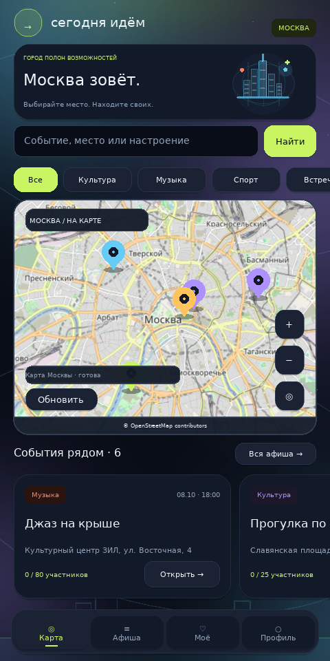
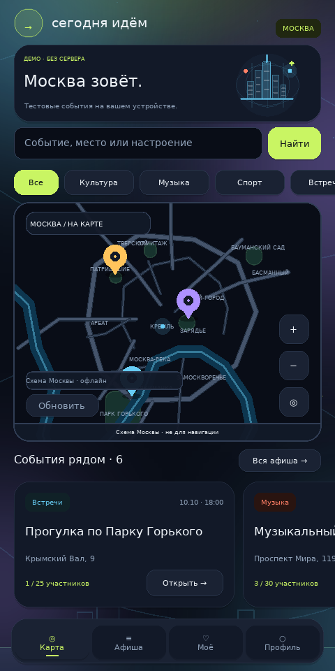

# Сегодня идём

Приложение на **Kivy для Android и ПК**: карта Москвы, афиша, участие в событиях и публикация своих мероприятий. Сервер — **FastAPI**, база — **SQLAlchemy 2 ORM**, локально SQLite, при развёртывании PostgreSQL. Реализовано по двум приложенным документам и дополнительному списку требований.



Карта использует **OpenStreetMap без API-ключа**; резервный источник — HOT / OSM France. Во время подключения и при отсутствии сети видна подписанная авторская схема Москвы. Кнопка **«Обновить»** повторяет подключение. Схема приблизительная и не предназначена для навигации; онлайн-карта содержит настоящие улицы и здания.

Версия 1.2: общий анимированный ночной фон с цветными переливами, световыми орбитами и мерцающими звёздами; плавное появление карточек и экранов, анимированные кнопки, поля и маркеры. На небольших экранах карта получает больше места; события открываются по маркерам и через афишу. Вход — пароль и почтовый код; Google-вход удалён. [Оформление и анимации](docs/DESIGN.md).

[Анимации](docs/animated-design.gif) · [Вход](docs/login.png) · [Регистрация](docs/registration.png) · [Почтовый код](docs/email-code.png) · [Подключение](docs/android-connect.png) · [Афиша](docs/event-list.png) · [Событие](docs/event-detail.png) · [Профиль](docs/profile.png) · [Окно 360 × 700](docs/moscow-small.png).

## Тестовая версия без сервера

На Windows запустите **`START_DEMO_WINDOWS.bat`** из обновлённой папки проекта. Он откроет приложение с локальным тестовым организатором и шестью мероприятиями Москвы. Сервер, настройка почты, пароль и код не требуются. Интернет нужен только для первой установки Python и зависимостей; после установки демо работает офлайн.

Чтобы обновить старую копию, закройте приложение, откройте PowerShell и выполните:

```powershell
$u = Join-Path $env:TEMP 'TodayGo-update.bat'
Invoke-WebRequest -UseBasicParsing 'https://raw.githubusercontent.com/dhdhsbdbd132-sys/ssdsad/main/UPDATE_WINDOWS.bat' -OutFile $u -ErrorAction Stop
& $u
```

Используйте свежий обновлятор из этой команды: старые версии могут не принимать новый файл запуска. Он сохраняет `.env`, базу, окружение и пользовательские файлы.

В демо доступны карта с маркерами, поиск и фильтры, список и карточка события, создание, редактирование своих событий, удаление с подтверждением, участие и отмена участия. Изменения сохраняются отдельно в `.data/client/demo/events.json`; после перезапуска они остаются. Карта — подписанная офлайн-схема Москвы, а не подробные улицы. На устройстве видна отметка **«ДЕМО · БЕЗ СЕРВЕРА»**.



В исходниках также есть кнопка **«Открыть тестовую версию»** на экране подключения. Выбор режима сохраняется на устройстве; перейти к API можно через профиль. Опубликованный APK **1.2.0** содержит прежний серверный клиент. Тестовый режим добавлен в исходники; новый APK в этом обновлении не собирался.

На Linux/macOS с установленными клиентскими зависимостями:

```bash
bash scripts/run_demo.sh
```

## Windows: запуск двойным щелчком

1. Скачайте архив через **Code → Download ZIP** и полностью распакуйте его.
2. В распакованной папке дважды нажмите **`START_WINDOWS.bat`**.
3. Дождитесь установки зависимостей и открытия окна приложения. Интернет нужен при первом запуске; повторный запуск использует уже установленное окружение.

Если подходящего Python 3.12 x64 нет, файл установит официальный Python в отдельную пользовательскую папку `TodayGo\Python312`; подпись установщика проверяется перед запуском. Используется официальный Windows installer 3.12.10. Глобальные PATH и PowerShell ExecutionPolicy не изменяются, права администратора не требуются. Поддерживается Windows 10/11 x64.

Сервер запускается автоматически только на localhost. При закрытии клиента останавливается только сервер, созданный этим запуском. Текущие `.env`, база и пользовательские файлы сохраняются. Два одновременных запуска из одной папки блокируются. Окружение `.windows-venv` и данные `.data` не входят в Git.

Для почтового кода в режиме разработки дважды откройте **`READ_CODE_WINDOWS.bat`**, введите почту из регистрации и перенесите показанный код в приложение. Если настроен SMTP, используйте письмо на вашей почте.

Для настоящих писем Mail.ru закройте приложение и запустите **`CONFIGURE_EMAIL_WINDOWS.bat`**. Выберите Mail.ru, введите полный адрес отправителя и **пароль для внешнего приложения**; обычный пароль почты может быть отклонён. Создать его можно в Mail.ru → Настройки → Все настройки → Безопасность → Пароли для внешних приложений. Мастер использует SSL/TLS 465, скрывает ввод пароля, сохраняет настройки только в локальном `.env` и предлагает тестовое письмо. Затем запустите приложение заново и запросите новый код. [Официальная инструкция Mail.ru](https://help.mail.ru/mail/mailer/popsmtp/).

Чтобы обновить установленную копию, закройте приложение и используйте свежий **`UPDATE_WINDOWS.bat`** из PowerShell-команды выше. Он обновляет исходники из GitHub, сохраняет базу, `.env` и окружение; предыдущие файлы копируются в `.data/updates`. Файл можно запускать из Downloads: сначала выбирается `ssdsad-main` на рабочем столе. Для другой папки перетащите её на файл обновления.

Для телефона на той же Wi-Fi-сети откройте **`START_ANDROID_SERVER_WINDOWS.bat`**, установите APK и введите в приложении адрес, показанный в окне сервера. Отметьте «Сервер на моём ПК через Wi-Fi». ПК должен оставаться включённым. [Android: установка и сборка](docs/ANDROID.md).

Если ранее скачанная версия закрывается с ошибкой `ButtonBehavior.on_press() takes 1 positional argument but 3 were given`, закройте приложение и запустите **[REPAIR_WINDOWS.bat](REPAIR_WINDOWS.bat)**. Этот самостоятельный файл можно сохранить в любую папку: он сначала ищет проект `ssdsad-main` на рабочем столе, затем рядом с собой. Для другой папки перетащите её на файл ремонта. Он переименует конфликтующее свойство анимации только в `client/todaygo/theme.py`, сохранит исходный файл в `.data/repairs` и выведет точный путь к исправленному проекту. Затем откройте `START_WINDOWS.bat` именно из этой папки. Повторный ремонт уже исправленного файла ничего не меняет; база, настройки и установленные зависимости сохраняются. Интернет и права администратора для ремонта не нужны.

Windows bootstrap и установка Python требуют проверки на настоящем Windows-компьютере. В облачной Linux-среде проверены подготовка зависимостей, реальный запуск API/Kivy, повторный запуск и остановка процессов через тот же Python-супервизор. Этот файл запускает приложение локально; удалённого доступа к вашему компьютеру у агента нет.

## Быстрый запуск (Linux / macOS, Python 3.12)

```bash
bash scripts/setup.sh
bash scripts/run_api.sh
```

Во втором терминале:

```bash
bash scripts/run_client.sh
```

Окно Kivy требует графическую среду. В облачной машине для проверки без дисплея:

```bash
SDL_VIDEODRIVER=offscreen TODAYGO_MAP_MODE=offline bash scripts/run_client.sh
```

API работает на порту 8000. Swagger: `/docs`, OpenAPI: `/openapi.json`, проверка доступности: `/api/health`. `scripts/setup.sh` устанавливает зафиксированные зависимости, применяет миграции и добавляет шесть демонстрационных мероприятий Москвы. Повторный запуск не дублирует данные. У демо-организатора нет опубликованного пароля.

### Регистрация и почтовый код

1. В приложении откройте «Профиль» → «Войти или зарегистрироваться» → «Регистрация».
2. Для создания мероприятий отметьте «Хочу организовывать мероприятия».
3. Пароль: не менее 10 символов, строчная и заглавная буквы, цифра.
4. В режиме разработки письма сохраняются локально в `.data/mail/`, а не отправляются на настоящий адрес. Получить свой код можно командой:

```bash
.venv/bin/python scripts/read_dev_mail.py
```

Это отдельная локальная утилита, доступная только в режиме разработки. API никогда не возвращает код. Без SMTP письмо не отправляется: экран показывает локальный режим. Для настоящей почты используйте Windows-мастер выше или заполните `.env`: Mail.ru — порт 465, `SMTP_SECURITY=ssl`; серверы с STARTTLS — порт 587, `SMTP_SECURITY=starttls`. Проверка сертификатов включена. После изменения настроек перезапустите API.

### Мероприятия и карта

- Главный экран: панорамирование, масштабирование, центр Москвы, поиск и фильтры категорий, маркеры с переходом в карточку.
- Афиша: список, поиск по названию/описанию/месту, фильтр даты по московскому времени, страницы.
- «Моё»: события, в которых вы участвуете, и события, которые вы организуете.
- Создание: название, описание, категория, дата, время, адрес, число мест. Нажмите на карту, чтобы выбрать координаты.
- Карточка: подробности, место на карте, количество участников, участие/отмена.
- Автор и модераторы могут редактировать и удалять; удаление требует подтверждения.
- В основном режиме операции выполняются HTTP-запросами к FastAPI; клиент не подключается к БД. Тестовый режим использует отдельные локальные демо-данные.

## Android APK

[Скачать APK 1.2.0 напрямую](https://github.com/dhdhsbdbd132-sys/ssdsad/releases/download/v1.2.0/todaygo-1.2.0-arm64-v8a-debug.apk) · [Релиз и контрольная сумма](https://github.com/dhdhsbdbd132-sys/ssdsad/releases/tag/v1.2.0). Android **7.0+**, процессор **ARM64**. Архив распаковывать не нужно: откройте скачанный APK на телефоне и разрешите установку этому браузеру. Это debug-сборка проекта; физический телефон здесь не использовался для проверки.

1. Обновите Windows-копию проекта через `UPDATE_WINDOWS.bat`.
2. Откройте `START_ANDROID_SERVER_WINDOWS.bat` на компьютере и оставьте окно открытым.
3. Подключите телефон и ПК к одной Wi-Fi-сети.
4. На экране подключения APK введите адрес из окна сервера, отметьте «Сервер на моём ПК через Wi-Fi» и нажмите «Проверить и подключиться».

Адрес и выбор локального HTTP сохраняются после проверки API. `127.0.0.1` на телефоне относится к самому телефону. Для сервера в интернете используйте HTTPS; HTTP доступен только для явно выбранных адресов частной сети и эмулятора. Регистрация и все CRUD-действия требуют работающего API; сервер внутри APK не запускается. Почта настраивается на компьютере через `CONFIGURE_EMAIL_WINDOWS.bat`.

[Подробная инструкция установки и повторной сборки](docs/ANDROID.md). Конфигурация — `client/buildozer.spec`; workflow `.github/workflows/android.yml` сохраняет APK с SHA256 и исходным commit. Перед публикацией проверяются подпись, все нативные библиотеки, пакет приложения, шрифт с кириллицей, версия и разрешения.

## Роли и безопасность

| Роль | Права |
|---|---|
| Участник | Просмотр, поиск, участие и отмена своего участия |
| Организатор | Права участника + создание, редактирование и удаление своих событий |
| Модератор | Управление всеми событиями и участие |
| Администратор | Права модератора + назначение ролей и чтение аудита |

Самостоятельно можно зарегистрировать только участника или организатора. Администратор создаётся локально:

```bash
PYTHONPATH=backend .venv/bin/python -m app.cli create-admin --email admin@example.com
```

Пароль вводится скрыто. Администратор также проходит почтовую 2FA. Изменение роли отзывает сессии пользователя; смена собственной роли через API запрещена.

Реализованы Argon2id, обязательный почтовый фактор, короткие JWT access-токены, одноразовые refresh-токены с ротацией и обнаружением повторного использования, немедленный отзыв сессии при выходе, роли с проверками на сервере, аудит изменений, ограничение попыток, валидация данных, security headers и закрытые сообщения ошибок. Токены клиента хранятся только в памяти; после полного закрытия приложения нужен повторный вход.

Авторизация использует пароль и одноразовый почтовый код. Google-вход полностью удалён. OAuth2 endpoint сохраняется для авторизации Swagger с challenge_id и кодом. [Почта и инфраструктура](docs/SECURITY.md).

## Структура

```text
backend/app/api/           HTTP-маршруты, зависимости, Swagger
backend/app/schemas.py     Pydantic-запросы и ответы
backend/app/services/      правила авторизации, событий, участия и ролей
backend/app/repositories/  запросы через SQLAlchemy select и Session
backend/app/models.py      ORM-модели и связи
backend/app/core/          настройки, БД, криптография, ошибки
backend/migrations/        миграции Alembic
client/todaygo/api.py      HTTP-доступ к серверным данным
client/todaygo/demo.py     отдельные локальные тестовые данные без сервера
client/todaygo/screens.py  экраны Kivy
client/todaygo/maps.py     интерактивная карта и выбор координат
client/todaygo/theme.py    единое визуальное оформление
client/todaygo/motion.py   появление элементов и режим без анимации
client/todaygo/tile_transport.py HTTPS-тайлы, проверка изображений и кэш
client/assets/             шрифт с кириллицей и офлайн-схема
backend/tests/,client/tests/ автоматические проверки
scripts/                  запуск, установка и проверки
deploy/                   Docker, PostgreSQL и пример HTTPS-прокси
```

[Архитектура и БД](docs/ARCHITECTURE.md) · [Соответствие требованиям](docs/REQUIREMENTS.md) · [API](docs/API.md) · [Результаты проверки](docs/VALIDATION.md).

## Проверки

```bash
.venv/bin/pytest backend/tests -q
SDL_VIDEODRIVER=offscreen KIVY_NO_ARGS=1 \
KIVY_HOME="$PWD/.data/kivy" TODAYGO_MAP_MODE=offline \
.client-venv/bin/pytest client/tests -q
```

Серверные тесты используют временную БД; клиентские поднимают отдельный FastAPI на свободном порту и выполняют реальные HTTP-запросы. Проверены SQLite и PostgreSQL. SMTP-тесты проверяют SSL/STARTTLS, безопасные ошибки и откат; настоящую доставку Mail.ru нужно проверить со своими учётными данными. Результат Android-сборки указан в [инструкции](docs/ANDROID.md).

## Развёртывание

Для production необходимы PostgreSQL, случайный `SECRET_KEY` минимум 32 символа, SMTP, HTTPS и явные разрешённые hostnames. Небезопасная production-конфигурация отклоняется при старте. Есть `deploy/compose.yml` с закрытым портом БД, non-root/read-only контейнером API, ограничениями ресурсов и `deploy/nginx.conf` с TLS и лимитом запросов. Это конфигурация для развёртывания, а не опубликованный сервер. Секреты храните вне Git; подробности в `docs/SECURITY.md`.

Для повторной проверки на отдельной PostgreSQL-БД: `bash scripts/run_postgres_tests.sh` (Docker). Для контейнерной сборки в среде без DNS внутри Docker: `bash scripts/build_offline_image.sh`.
