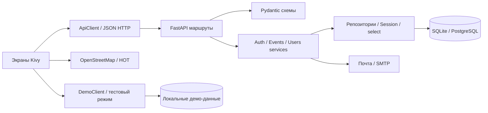
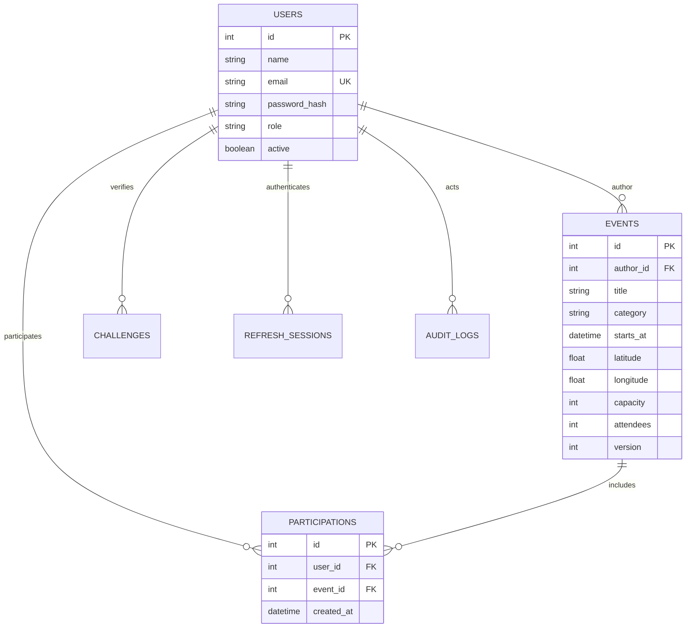

# Архитектура «Сегодня идём»

Модульный монолит соответствует описанию во вложении «на 16.09.docx». Предметная область — локальные мероприятия Москвы, пользователи и участие. Kivy-клиент независим от БД и серверных моделей.

## Разделение ответственности

- UI собирает данные, показывает ошибки и управляет навигацией. Не проверяет права вместо сервера и не исполняет SQL.
- `ApiClient` выполняет запросы, обрабатывает HTTP-коды, обновляет токены. Запросы идут в фоновом потоке, обновление интерфейса — через Kivy Clock.
- `DemoClient` реализует тот же контракт событий для отдельного тестового режима: локальный CRUD, поиск и участие с атомарным JSON-хранилищем. Он работает без API, почты и серверных моделей. Тестовый организатор относится только к демо-данным; при переключении режима клиент очищает пользователя и сессию.
- FastAPI-маршруты принимают и возвращают схемы, извлекают текущего пользователя и вызывают сервисы.
- Сервисы содержат правила: авторство, роли, вместимость, даты, одноразовые коды, сессии и транзакции.
- Репозитории читают ORM-объекты через `select`, `Session` и отношения.
- Модели описывают структуру хранения и ограничения; Alembic управляет версией схемы.
- `core` содержит инфраструктуру: настройки, подключение, хеширование и нормализацию ошибок.

В бизнес-логике нет прямого SQL. `PRAGMA foreign_keys=ON` используется только в адаптере SQLite для включения ограничений. DDL в миграциях создаёт структуру, а не заменяет ORM-CRUD.

В тестовом режиме используется подписанная офлайн-схема Москвы и явно отключается загрузка тайлов. Демо-хранилище отделено от серверной БД и настроек почты. `START_DEMO_WINDOWS.bat` устанавливает только зависимости клиента и открывает Kivy; backend и миграции запускаются основным launcher отдельно.

## База данных

`users` ↔ `events` — N:M через `participations`; уникальность пары запрещает повторное участие. Автор ↔ мероприятия — 1:N. Удаление мероприятия каскадно удаляет участие, сохраняя пользователей и аудит.

Дополнительные таблицы: `challenges` (HMAC кода, попытки, срок и признак использования), `refresh_sessions` (хеш токена, семейство, срок, использование и отзыв), `audit_logs` (кто, что, объект, дата). Историческая таблица `oauth_attempts` сохранена для совместимости ранее созданных БД; после удаления Google-входа она не используется.

Каждый запрос получает собственный `Session`. Успешная бизнес-операция заканчивается `commit`. При ошибке зависимость откатывает `rollback`. Версионные столбцы SQLAlchemy предотвращают потерянные обновления при одновременном участии, использовании кода и обновлении токена. Конфликт возвращает 409; клиент может повторить действие после обновления данных.

Даты хранятся в UTC; API возвращает timezone-aware ISO 8601, UI показывает UTC+3. Запросы с датой без часового пояса отклоняются. Локальная БД SQLite не требует отдельного сервера; production использует PostgreSQL. Миграция проверена применением и откатом на обеих СУБД.
